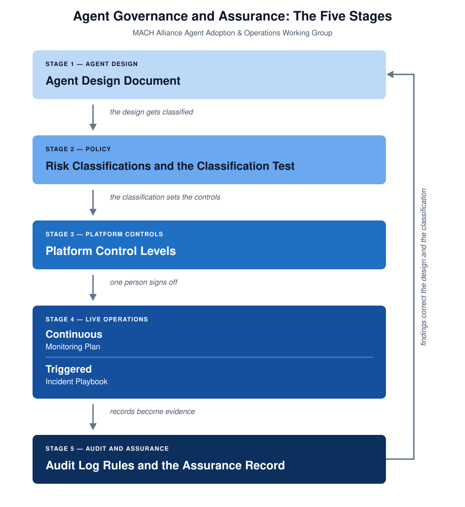

# Agent Governance and Assurance: The Five Stages

*A working document of the MACH Alliance Agent Adoption & Operations Working Group. September 2026 Draft, for discussion.*

## Purpose

Governance for agents holds together only when agent design, policy, platform controls, live operation and audit records reach each other. Each stage makes the one before it real.

The [README](README.md) is the short version: who the framework is for, and what to do first. This document gives the reasoning behind each stage, and a plan to deliver them one at a time.

We do our best to use plain words throughout. The [glossary](glossary.md) gives our word, what it means, and the word that other frameworks use for the same thing. [What we reference and cite](references.md) lists the works this framework builds on and which stage each one matches.

## The five stages at a glance

*Figure 1. The five stages, in the order you work in.*

| Stage | What you write | What it does | What it feeds |
|---|---|---|---|
| 1. Agent design | Agent Design Document | Records what one agent is for and what it can touch. | A description that stage 2 can classify. |
| 2. Policy | Risk Classifications and the Classification Test | Places that agent in a classification, with your reasons. | The controls stage 3 has to enforce. |
| 3. Platform controls | Platform Control Levels | Stands the agent up on a platform that holds it to those limits, and runs your evals against it. | A sign-off, and then live operation. |
| 4. Live operations | Monitoring Plan and Incident Playbook | Keeps the evals running, and says what happens when one fails. | The records stage 5 keeps. |
| 5. Audit and assurance | Audit Log Rules and the Assurance Record | Keeps proof of what the agent did, and proof that somebody is still checking. | Corrections to the classifications and the designs. |

## Every stage produces a working document

None of these five documents is finished when you write it. Each one keeps telling you that something earlier needs work.

An agent that fits no classification means the list is short a category. An audit finding means a classification's criteria were wrong. A monitor that reports a tool call outside the declared set means a control is not holding, and that the sign-off granted under it no longer applies.

Write each document expecting to revise it, and record the date you last did. A framework that only runs one way governs the agents you had when you wrote it.

## Stage 1: The agent design document

**What you write: Agent Design Document. It is a system card for the agent.**

Nobody can judge an agent's risk from its name. Somebody has to write down what the agent is for, what it does on its own, and which systems it can reach. That description comes first, and everything after it either enforces the description or checks it.

### What it contains

You write one document for each agent, before it goes near production. It covers:

- the outcome that the agent is for, how you measure it, and who owns that number;
- the purpose and the scope of the agent;
- the tools and the data that it needs, which is the list that stage 3 grants and nothing wider;
- what it can decide alone, and what it cannot;
- how it escalates to a person, and how a person overrides it;
- which classification this agent belongs to, and why.

An escalation table on its own tells you what to do when something goes wrong. It does not tell you how anybody knows this agent belongs in the classification it claims. Both belong in one document, because the escalation design depends on a true classification.

### Start with the outcome

The first item does real work. An agent with no stated outcome and no measure for it cannot be judged, and you cannot stop it on evidence. It is usually an agent that exists because agents are available. Write the outcome, the measure, and the person who owns the number. Stage 4 then has something to check the agent against besides its own description.

### Why the classification section carries the most weight

The classification section is the one a reviewer weighs hardest. It answers the stage 2 test with this agent's own details instead of in the abstract.

The document is close to a model card or a system card, covering the behavior and the authority of an agent rather than the training data and benchmarks of a model. The nearest match in other standards is [AIUC-1](https://aiuc-1.com/), which asks for compliance documents and failure plans at the level of a whole company. This document is for one agent, and it carries the proof of its own classification.

## Stage 2: Policy and risk classifications

**What you write: Risk Classifications and the Classification Test.**

This is the only stage that is not about a single agent. The classifications describe your whole company: the types of agent you build, the capabilities each type holds, and the controls that follow from them. Each agent is placed in one of them, and the record of the agent itself stays in stage 1.

You do not need the whole set before you ship. You need the one classification that your first agent belongs to, and the rest grows as you build agents that the set does not yet describe.

### The classifications

Judge each type of agent on how critical the process is that it automates, how sensitive the data is that it reaches, which regulations reach that process, how much money it can move, whether you can undo its actions, and how far the damage spreads. Say how an agent in each classification behaves in practice, and not only what its criteria are on paper.

If you already run a program against the [Cloud Security Alliance's agentic profile](https://labs.cloudsecurityalliance.org/agentic/agentic-nist-ai-rmf-profile-v1/) for the NIST AI RMF, its four autonomy levels sit at this stage. Use those rather than deriving a parallel set beside them.

### The classification test

The classifications need a test beside them. The Classification Test is a set of questions that somebody walks through to show why an agent sits in one classification rather than the one above it. The answers stay with the agent, in the classification section of its design document.

Skip the test and every team declares its own agent low risk, and you are left with a document asserting that the risk was assessed. The test also has to run again against what monitoring sees, because a new model version or a new tool can push real behavior above what the paperwork claims.

## Stage 3: Platform controls, in three levels

**What you write: Platform Control Levels.**

Some companies write one platform standard for every agent, and security must approve it before anything ships. Teams then debate the scope for two quarters, and nobody deploys. This stage has to work for one agent, in this sprint, with no company-wide dependency.

It covers the whole setup the agent runs on: the model and its version, the tools it can call, the framework it is built on, where it is hosted, and an agent login. Framework here means the software the agent itself is built on, and not this governance framework. The design document in stage 1 lists the tools and the data that the agent needs, so this stage grants that list and refuses the rest.

### The three levels

Every level enforces least privilege. What changes between them is who decides the permissions and what keeps them correct. Each level is useful on its own, and Level 1 is a legitimate place to stand while you learn.

1. **Level 1, an agent login.** Give the agent a login that it shares with nothing else, scoped to the tools and the data its design document lists. Write down how to revoke the credentials by hand. The [FIDO Alliance's agentic authentication work](https://fidoalliance.org/fido-alliance-to-develop-standards-for-trusted-ai-agent-interactions/) is where the cross-vendor version of this login is being standardized.
2. **Level 2, the classification decides.** Tie the scope of the credentials to the agent's classification from stage 2. Policy then sets a ceiling that an agent in that classification cannot be granted past, and an engineer no longer decides it case by case.
3. **Level 3, code enforces it.** Add policy as code, automatic setup and revocation, and a continuous check that the granted permissions still match the declared classification.

Level 3 is the full company model. These levels make it a destination rather than a condition you have to meet before you start. State the level that each agent is on.

Stage 4 is what corrects this stage. A monitor that reports a call to a tool outside the declared set has told you that a control you believed you had is not holding.

### Run the evals against the platform you built

Run your evals against the setup you stood up: this model version, these tools, this framework, this host. An eval that passed against a different configuration tells you about that configuration.

Record what the evals found, and keep the record with the design document. The person signing off has to read it, and stage 4 needs a baseline to compare live behavior against.

### The step across: sign-off before it goes live

A gate sits between this stage and stage 4. One named person signs off on the agent as a whole: what it is for, its classification, the platform it runs on, what the evals showed, and the risk that is left. Record the name, the date, and the version of the document they signed. What they sign off is what the platform enforces, and not a description of it.

## Stage 4: Live operations, from watching to response

**What you write: Monitoring Plan (continuous) and Incident Playbook (when an alert starts).**

This stage holds two connected pieces of work: what you watch all the time, and what you do when it tells you something.

### What you watch all the time

The Monitoring Plan defines what you record on every run: the tool calls and their arguments, the inputs and the outputs, and enough of the run to replay it.

It also puts the stage 3 evals on a schedule that nobody has to remember, so that they keep running against the live agent without a person starting them. It says which numbers count as normal, and what starts an alert. An eval that fails is one of the things that starts one.

### What an alert starts

The Incident Playbook defines what happens after an alert: triage, a review of the run record, a fix, and a review after the incident.

Write the playbook for the ways that agents fail. Examples are tool calls that fail in a chain, prompt injection, and quiet scope creep. Copying it from ordinary software incident response will not cover those.

### Monitoring has levels too

The distance between what a framework asks for and what most companies can do today is largest here. Monitoring gets the same treatment as the platform controls in stage 3. Its levels are a separate climb, because they measure what you can see and not what the agent can reach. An agent can sit at platform control Level 3 and monitoring Level 1.

1. **Level 1, the tool call log.** Log every tool call and its arguments. Keep the inputs and the outputs for a fixed period. Alert on a few coarse signals: a call to a tool outside the declared set, an unusual volume, or a high escalation rate.
2. **Level 2, run records.** Store the prompts, the context and the outputs of a run. Compare live behavior to the design document, and alert on drift as well as on errors.
3. **Level 3, tested and replayable.** Replay a run, and test it against known failure modes.

State the level that each agent is actually on. A sign-off that assumes a monitor which does not exist is worse than one with the limit written on the record.

A new group of products is emerging to do some of this work, which [Gartner calls guardian agents](https://www.gartner.com/en/newsroom/press-releases/2026-04-28-gartner-identifies-six-steps-to-manage-artificial-intelligence-agent-sprawl): agents that supervise other agents, for visibility, continuous assurance and runtime enforcement. Whether you buy one or build it, this stage is where it sits, and the Monitoring Plan is what tells you whether it covers what you need.

## Stage 5: Audit and assurance

**What you write: Audit Log Rules and the Assurance Record.**

Stage 4 records things for debugging. The run records and the tool calls help an operator understand what an agent did.

Compliance asks for different things: locked records, a defined retention period, proof that changes are visible, and a map to the frameworks that you already follow. Those include SOC 2, ISO 27001, and the logging duties in the EU AI Act for higher-risk systems.

### Two records, and the second one is the harder one

The Audit Log Rules govern the first record: what the agent did, which decisions it took, and who signed off. Most programs can produce something here, because it is the record their existing logging already wanted to be.

The second record is the assurance record: which evals ran, when, what they found, and what changed because of it. The first shows what the agent did, and the second shows that somebody is still checking, on a date after the sign-off. An auditor will ask for both, and the second is the one that usually does not exist.

That record is also the evidence for the arrow back up the figure. A finding that changes a classification or a design should be traceable to the eval run that produced it.

### Reuse the maps that already exist

[AIUC-1](https://aiuc-1.com/) covers the same ground for agents, and publishes maps to NIST AI RMF, ISO 42001, the EU AI Act and MITRE ATLAS. Log rules that you build against AIUC-1 inherit those maps, so you do not have to derive them again. ISO/IEC 42001 is the natural certification partner to this stage.

This stage keeps the debugging question apart from the question that an auditor asks: can you prove what happened, and why? Both draw on the same records, in different documents.

### Findings from here change stages 1 and 2

The findings from this stage have to correct the classifications and the thresholds in stage 2, and the designs in stage 1. Those classifications were written to satisfy exactly these audits.

## How to deliver this one piece at a time

Five stages sound like a company program that runs for many quarters, and programs like that tend not to ship. The stages are designed so that a narrow version works from end to end quickly. You then add maturity one stage at a time.

A reasonable first pass, on one or two agents that you already build:

1. Write their design documents: the outcome each agent is for, and the tools and the data each one needs.
2. Write the one or two classifications those agents belong to, and their answers to the classification test.
3. Apply Level 1 platform controls: an agent login for each one, least privilege on it, on a stated model version and host. Run whatever evals you have against that setup, and record what they found. Then record who signed off. At this size that is a few lines at the end of the design document, and not a process.
4. Start stage 4 monitoring for those agents only. Level 1, which logs tool calls and holds a few alerts, is enough, together with a schedule that reruns the evals.
5. Add the stage 5 log rules once you hold real records to keep, and open the assurance record with the first scheduled eval run.

After that narrow slice works from end to end, widen stage 3. Move toward automatic setup that follows the classification, and then toward policy as code. By then the working group is scaling something that works, instead of designing something that nobody has deployed.
